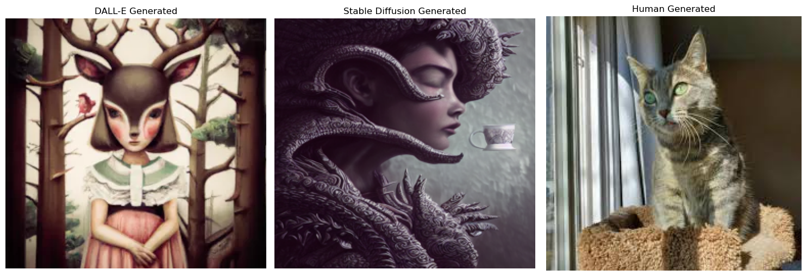

# Santiago Miro's Data Science Portfolio

Hello! I'm Santiago Miro, a MSc. Physics graduate from the [University of Alberta](https://en.wikipedia.org/wiki/University_of_Alberta) with a strong passion for data science. Welcome to my public portfolio, where I showcase my skills and share my journey in the realm of data.

## About Me
With a solid foundation in mathematics, statistics, and data visualization, I've developed innovative solutions to complex problems over the course of my two-year experience in software development and data science. My unique blend of analytical and technical skills enables me to analyze intricate data sets, identify patterns, and extract meaningful insights.

## Contact Information

Feel free to reach out to me at: mirot.santiago@gmail.com

## Key Skills and Experience

* **Data-Driven Approach**: I am committed to leveraging my skills to drive impactful results for organizations, utilizing a data-driven approach in decision-making.

* **Cross-Functional Collaboration**: I've successfully collaborated with cross-functional teams to develop and deploy software solutions, conduct data analysis, and create data-driven models that inform research decisions.

* **Technical Proficiency**: Proficient in Python and other data analysis tools, I've developed robust simulations, conducted statistical analysis, and built predictive models.

## Portfolio Highlights

Explore my portfolio to find my CV and a collection of personal projects that implement state-of-the-art Data Science techniques. I am continually excited to bring my technical and analytical skills to a data science role where I can learn, grow, and make a meaningful impact.

If you are looking for a data-driven individual passionate about leveraging data to drive business outcomes, I'd love to connect with you. Let's explore the possibilities together!

## [Project 1: Image Classifier](https://github.com/SantMiro/Image_Classifier)

This GitHub project is a personal endeavor aimed at exploring the classification of AI-generated images using a Convolutional Neural Network (CNN). The CNN is trained to discern between three distinct classes:  DALL-E-2 - generated images, Stable Diffusion-generated images, and Human-made images. 

The DALL-E-2 - generated images were scraped from the source [DALL-E 2 Gallery](https://dalle2.gallery).
The Stable Diffusion-generated images were accessed from [DB Stable Diffusion](https://huggingface.co/datasets/poloclub/diffusiondb).
The Human-generated images were both scraped from google and accessed from the source [DB Human Generated](https://huggingface.co/datasets/poloclub/diffusiondb).

## [Project 2: Metabolomic Analysis in Pediatric Crohn's Disease Patients: A Machine Learning Approach](https://github.com/SantMiro/Metabolomics_Analysis)

The objective of this work is to perform an exploratory data analysis on serum metabolomics from 56 pCD patients. Samples were collected twice: once at study initiation (Visit One) and again for completion (Visit Four). The collected serum underwent liquid chromatography followed by mass spectrometry to identify 131 compounds.

Serum metabolites are analyzed using Unsupervised (U.ML) and Supervised (S.ML) Machine Learning algorithms. U.ML is used to reduce the dimensionality of the data and identify clusters, while S.ML is used to develop regression and classification algorithms to assess the correlation between metabolites and disease activity.

Results show that Tryptophan is the metabolite that ranks the highest in feature importance scoring. Histidine is another metabolite that correlates well with the severity of the disease. In the regression analysis, it was observed that Partial Least Squares (PLS) with LOL reduction setting incurred the least Mean Squared Error (MSE) of 0.8806. In the classification process, Random Forest with Linear Discriminant Analysis (LDA) setting achieved the least False Negative rate of 0.53, and K-Nearest Neighbors (KNN) with Principal Component Analysis (PCA) setting yielded the highest accuracy score of 63. 

See full paper [here](https://github.com/SantMiro/Metabolomics_Analysis/blob/main/Metabolomics_Analysis.pdf).

